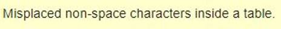
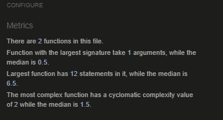

<h1>Testing Section</h1>

## Contents

* [Code validation](#code-validation)
* [Accessibility/Lighthouse testing](#accessibility/lighthouse-testing)
* [Responsive testing](#responsive-testing)
* [Manual testing](#manual-testing)
* [Testing user stories from User Experience (UX)](#testing-user-stories-from-user-experience-(ux))
* [Fixes and Known Bugs](#fixes-and-known-bugs)

[View README.md](https://github.com/aryan008/team_lift_sprint/blob/main/README.md)

### Code validation
The W3C Markup Validator, W3C CSS Validator, JSHint JavaScript Validator Services and PEP8 online were used to validate the project to ensure there were no errors in the project. 

##### W3C CSS Validator

See the below screenshot for W3C CSS validation, with no errors present:

##### W3C Markup Validator

In using the W3C markup validator, a number of non-fixable errors were present through the validation process. See below explanations for error explanation.

1) Header error

The head element is deemed to be missing the child element "title". This is present on the base.html page, however this error results where base.html is extended and as such the validator has not picked it up. No further edits required.

2) Spacing error

W3C noted that there are non-space characters inside a table. This is present on any templated language "for" loops, whereby a html tag is not present on either side of these statements. No further edits required due to python language used in HTML templates.

3) URL error

This refers to the use of "{}" url references throughout the HTML pages. These braces are used for site references and again, due to django language site navigation. No edits required.

4) Sort error

The below three errors are present on the HTML pages where the sort function is used. Python language "if" statement is present on the user interactive sort statement and possible through the use of python logic. No edits necessary.

As above explanations, these are not true errors but due to the templating language present in Django/Python language. HTML validation showed no further errors and as such this project has passed this testing protocol.

##### JSHint JavaScript Validator Services

See below screenshots for results on JSHint validation on seperate JS code (3) - no errors present:

##### PEP8 online
<h1>UUUUPPPPDAAAATE</h1>

### Accessibility/Lighthouse testing

[WAVE Web Accessibility Evaluation Tool](https://wave.webaim.org/) was used on all pages to review site accessibility. No errors on the site occurred as a result of this accessibility testing.

See below for results on various pages:

* Home Page

* Products Page

* Bag Page

* Checkout Page

* Profile Page

[Google Lighthouse](https://developers.google.com/web/tools/lighthouse) was used on all pages to review site performance across a number of metrics. Green scores were awarded on the site across all lighthouse metrics as a result of this performance testing.

See below for results on various pages:

* Home Page

* Products Page

* Bag Page

* Checkout Page

* Profile Page

### Responsive testing

The site adheres to the Bootstrap grid layout and breakpoints. Additional media queries have been used to align many aspects of the site. The media breakpoints have been noted in the README.md file. Additionality, [Google's mobile test](https://search.google.com/test/mobile-friendly) has been used for mobile functionality, with the result of "Page is mobile friendly" achieved as per below:

Virtual devices have consisted of testing on the following screen types on Google Chrome:

#### Snippets of site page screenshots across device widths

Widths used to test the below are:
* 1400px - desktop
* 768px - ipad
* 320px - iPhone 5SE

##### Home page

##### Products page

##### View product page

##### View product page - reviews

##### Bag page

##### Checkout page

##### Profile page

##### Blog page

### Manual testing

The following is a breakdown of successful manual testing performed on the site, broken out by subcomponent.

Area | Test Narrative | Applicable screenshot (if needed) | Result
---- | -------------- | --------------------- | ------
Navbar | Team lift sprint click results in redirect to homepage | | Pass
Navbar | Navbar items and drop-down menus link to correct site page | | Pass
Navbar | Search box functionality works as expected | See User story 6) below | Pass
Navbar | Entering no text into the searchbar and hitting search results in an error  | [Link](media/readme/mt-1.JPG) | Pass
Navbar | Hover on bag button changes colour | | Pass
Navbar | Account dropdown pages present depend on user access rights | [Link](media/readme/mt-2.JPG) and [Link](media/readme/mt-3.JPG) | Pass
Navbar | On below large screens, the navbar condenses to the burger icon | See responsive screenshots | Pass
Navbar | The bag € amount updates appropriately and corresponds with actual cost | [Link](media/readme/mt-4.JPG) | Pass
Home page | The media images resize and stack on mobile | | Pass
Home page | The category buttons appropriately redirect to the correct product types | | Pass
Home page | The shop now button brings to all products | | Pass
Footer | Support/Contact links open the appropriate pages | | Pass
Footer | Social links open up the correct website in a new browser window | | Pass
Footer | Footer stays on bottom of page on all site pages | | Pass
Products | Correct number of products displayed per type | | Pass
Products | The sort functionality works on all pages | | Pass
Products | Image cards correctly displayed on all screen sizes | | Pass
Products | View buttons/image click for individual products appropriately bring to specific product detail | | Pass
Products | Category tag present for all products | | Pass
Products | Sale items have red pill badge/slashed old price and % discount | | Pass
Products | Spring back to top button locates correctly on page | | Pass
On sale | Page only shows items on sale, inclusive of above "Products" tests | | Pass
Product detail | Name, description, category, image, price/sale price with strikethrough all correctly related to product | | Pass
Product detail | Quantity buttons displayed | | Pass
Product detail | Quantity buttons minus sign disabled below "2" | [Link](media/readme/mt-5.JPG) and [Link](media/readme/mt-6.JPG) | Pass
Product detail | Add to bag/Continue shopping work appropriately | See user story response 11) and 15) below | Pass
Product detail | No image picture is displayed if a product image is missing | | Pass
Product detail | User prevention of submitting a second review | [Link](media/readme/added-review-already.JPG) | Pass
Product detail | Previous reviews shown and ordered by date descending(latest first) | [Link](media/readme/previous-reviews.JPG) | Pass
Product detail | Form appears to user yet to make a review | [Link](media/readme/user-review-allowed.JPG) | Pass
Product detail | Number of reviews available | [Link](media/readme/user-review-allowed.JPG) | Pass
Product detail | Review product form unaccessible to unregistered users | [Link](media/readme/unregistered-reviewer.JPG) | Pass
Product detail | Superuser can delete reviews | [Link](media/readme/delete-review.JPG) | Pass
Product detail | Submit review button processes the form correctly | | Pass
Product detail | Star rating must be filled in for review to post | [Link](media/readme/star-error.JPG) | Pass
Shopping bag | Item name, quantity, sale save amount, image, description and subtotal all work correctly | | Pass
Shopping bag | Sale save amount for on sale items updates appropriately with quantity of that item | | Pass
Shopping bag | Update quantity and remove buttons appropriately work for each item | | Pass
Shopping bag | Grand total/delivery fee accurately reflects the correct amount | | Pass
Shopping bag | Delivery fee above €100 is correctly waived | | Pass
Shopping bag | Checkout button and keep shopping button work appropriately | | Pass
Shopping bag | For items on sale, the sale price is correctly used | [Link](media/readme/mt-7.JPG) and [Link](media/readme/mt-8.JPG) | Pass
Shopping bag | Putting quantity to 0 and hitting update button works the same as the remove button | | Pass
Shopping bag | On small devices, the key information is displayed at the top | [Link](media/readme/mt-9.JPG) | Pass
Checkout | Form and order to be processed correctly stack on mobile | | Pass
Checkout | For a logged in user who has saved details, the checkout delivery/billing info is autopopulated | | Pass
Checkout | For a logged in user who checks the checkbox, their profile delivery/billing info updates on the profile page | | Pass
Checkout | The country dropdown field lists correctly | | Pass
Checkout | Total card charge narrative and order grand total correctly match | | Pass
Checkout | Item quantity, price/sale price, price per unit, subtotal and delivery charge all correctly shown | [Link](media/readme/mt-10.JPG) | Pass
Checkout | Create an account or login to save this information line redirects appropriately | | Pass
Checkout | Stripe error handling on incorrect card processing notifies the user | See user story response 9) below | Pass
Checkout | Edit bag button returns to bag page | | Pass
Checkout | With correct complete order fulfillment, processing widget appears and success html page opens for user with details | | Pass
Checkout | On complete order, for a logged in user this order is displayed on their profile | | Pass
Checkout | Order will not be completed until the fields are correctly filled out | | Pass
Checkout success | After placing order, toast notification detail shown | [Link](media/readme/mt-11.JPG) | Pass
Checkout success | Keep shopping button correctly works | | Pass
Checkout success | Order breakdown details correct on all item metrics upon successful payment | [Link](media/readme/mt-12.JPG) | Pass
Checkout success | Stripe webhooks shows status 200 success and amount captured matches site total | [Link](media/readme/mt-13.JPG) | Pass
Checkout success | Order appears in logged in user profile page | | Pass
Toast messages | Toast notifications are shown correctly for success, informational purposes and errors | | Pass
Toast messages | Notifications are dismissed on click | | Pass
Toast messages | On small devices, toasts are displayed appropriately and stacked | | Pass
Toast messages | For CRUD bag toasts, price/image/quantity/subtotal/delivery/grand total all correctly display | | Pass
Toast messages | Delivery "free" remaining amount displayed on bag toasts below €100 | | Pass
Toast messages | View bag and checkout buttons appropriately work | | Pass
Toast messages | Superuser CRUD product additions/modification/deletion messages are all appropriately correct | | Pass
Profile | Default information is correct | | Pass
Profile | On updating default information, this feeds through to prefilled checkout form correctly | See user story response 19) below | Pass
Profile | Order history shows all previous orders of the site profile | See user story response 17) below | Pass
Profile | Order history has reference number link that takes the user to the detail of that previous order | | Pass
Profile | On clicking this reference number, an informational notification is displayed to confirm this is a past order | | Pass
Blog | Add blog button works appropriately | | Pass
Blog | Read post in full button brings user to full post | | Pass
Blog | Blog entries are stacked by date descending order (latest first) | [Link](media/readme/blog-order.JPG) | Pass
Blog | The narrative at top of page correctly identifies latest post | [Link](media/readme/blog-order.JPG) | Pass
Blog - full post | Superuser can edit or delete blog | [Link](media/readme/blog-superuser.JPG) | Pass
Blog - full post | Edit/delete buttons work appropriately | | Pass
Blog - full post | On editing a blog, it appropriately updates across the individual blog and blog home page | | Pass
Blog - full post | Back to blogs button works appropriately | | Pass
Blog - full post | Blog posts correctly identifiy spacing and/or line breaks/symbols | [Link](media/readme/blog-lines.JPG) | Pass
Site Management | On the products pages, each item has an edit/delete button | |
Site Management | For above, clicking delete deletes the item in full and a toast notification appears | | Pass
Site Management | For above, clicking edit brings the superuser to that specific item and allows them to edit the various metrics associated with it, including image change/discount percent/on sale boolean/description and category | [Link](media/readme/mt-14.JPG) | Pass
Site Management | For above, editing the product results in the new display updates across the site, including "on sale" recategorisation if appropriate and sale price update | | Pass
Site Management | Clicking the site management in navbar allows a product to be added with all the appropriate info needed. Cancel button and add product button appropriately work | [Link](media/readme/mt-15.JPG) | Pass
Site Management | Adding a product in site management displays it in the correct category, including sale price where appropriate | [Link add](media/readme/mt-16.JPG), [Link toast](media/readme/mt-17.JPG) & [Link result](media/readme/mt-18.JPG) | Pass
Site Management | Editing a product works correctly | [Link](media/readme/mt-18.JPG) | Pass
Site Management | Deleting a product works correctly | [Link](media/readme/mt-19.JPG) | Pass
 

### Testing user stories from User Experience (UX) section

The below is the testing section of both the first time and frequent visitors user story requirements. The table is split as following:
- User story requirement as per ReadMe file
- Response design as per ReadMe file
- Relevent project screenshot(s)/narrative

Number | User story requirement | Response design | Screenshot(s)/Narrative
------ | ---------------------- | --------------- | -----------------------
1 | My impression of the site to be a positive experience | Colour/Font/Layout/Navigation/CTA structure. Responsive button elements and appropriate redirects/toast/CRUD messages. Clear call to action on user progression from site landing to purchasing item(s). | Below

Number | User story requirement | Response design | Screenshot(s)/Narrative
------ | ---------------------- | --------------- | -----------------------
2 | To understand the main purpose of the site | Displayed on the landing “home” page. | Below

Number | User story requirement | Response design | Screenshot(s)/Narrative
------ | ---------------------- | --------------- | -----------------------
3 | To purchase relevant equipment related to individual/team sports | Content of the home page displays clear CTA on which section the user should click. Further, Navbar links are split appropriately based on product category | Below

Number | User story requirement | Response design | Screenshot(s)/Narrative
------ | ---------------------- | --------------- | -----------------------
4 | Create a profile - including login/register functionality | Available in the navbar for non-registered/non-logged in users. | Below

Number | User story requirement | Response design | Screenshot(s)/Narrative
------ | ---------------------- | --------------- | -----------------------
5 | An instant feedback loop from site navigation on what I am doing | The use of toast popups and checkout success features provides feedback to users on edit/delete/checkout bag items. | Below

Number | User story requirement | Response design | Screenshot(s)/Narrative
------ | ---------------------- | --------------- | -----------------------
6 | Easy navigation of the site including searching for a term | Site is simplistic in nature as an online store - 3 click approach taken as noted in the UX section of this ReadMe. Search bar included in navbar | Below

Number | User story requirement | Response design | Screenshot(s)/Narrative
------ | ---------------------- | --------------- | -----------------------
7 | Built-in safety protocols – user authentication, appropriate redirects, site action feedback | Django allauth templates are included in the project for use of their safety protocols | Below

Number | User story requirement | Response design | Screenshot(s)/Narrative
------ | ---------------------- | --------------- | -----------------------
8 | The ability to edit/delete any items in my bag | Any user can edit/delete bag items when they view their bag before checkout. | Below

Number | User story requirement | Response design | Screenshot(s)/Narrative
------ | ---------------------- | --------------- | -----------------------
9 | Secure card payment protocols | Stripe safety protocols and card processing is applied, allowing the user to securely checkout. | Below

Number | User story requirement | Response design | Screenshot(s)/Narrative
------ | ---------------------- | --------------- | -----------------------
10 | Ability to view my checkout items if I have accidentally exited the site | Cookie storage in the browser allows an individual to exit the site and reenter without the loss of any items in their bag. | Manual check that cookie item has stored on site page inspection. Manual forced site browser exit - reopen of site has stored bag dictionary.
11 | Buy an item without registering | All non-registered user CRUD functionality is present despite not having an account. | Noted in 3) above.
12 | Browse products easily including sorting them | As per (3) above. Sort function present on all product pages | Below

Number | User story requirement | Response design | Screenshot(s)/Narrative
------ | ---------------------- | --------------- | -----------------------
13 | View and purchase whats on sale | On sale section linked in the navbar. Further, all products that are on sale have a red pill image showing how much they are on sale, plus the percentage discount on the product. On checkout, the user is shown how much they are saving in euro by purchasing this on sale item. | Below

Number | User story requirement | Response design | Screenshot(s)/Narrative
------ | ---------------------- | --------------- | -----------------------
14 | Have a FAQ section where I can get in touch with the company regarding shipping/delivery, etc. | FAQ links are present at the bottom of each html page of the site. | Below

Number | User story requirement | Response design | Screenshot(s)/Narrative
------ | ---------------------- | --------------- | -----------------------
15 | See if I have any shipping costs | Delivery costs are shown in both the bag, toast notifications and checkout views, as well as an indication of how much extra they should spend to obtain free delivery. | Below

Number | User story requirement | Response design | Screenshot(s)/Narrative
------ | ---------------------- | --------------- | -----------------------
16 | See any product reviews and enter one myself | View product reviews available to all users in product detail - logged in users can enter a review | Below

Number | User story requirement | Response design | Screenshot(s)/Narrative
------ | ---------------------- | --------------- | -----------------------
17 | Read any articles regarding fitness | Blog viewing present for all viewers accessible through the navbar | Below

Number | User story requirement | Response design | Screenshot(s)/Narrative
------ | ---------------------- | --------------- | -----------------------
18 | Ability to reset my password and forgot my password verification | Frequent vistor (1) - password functionality present on the login section of the navbar | Below

Number | User story requirement | Response design | Screenshot(s)/Narrative
------ | ---------------------- | --------------- | -----------------------
19 | View my previous orders | Frequent vistor (2) - Ability to view past orders for registered users on their profile page on the navbar | Below

Number | User story requirement | Response design | Screenshot(s)/Narrative
------ | ---------------------- | --------------- | -----------------------
20 | Log in and out easily | Frequent vistor (3) - Present on the navbar | Noted in 4) and 7) above
21 | Save/Update my contact details | Frequent vistor (4) - Registered users can update their contact/delivery/billing details on the profile app, which feed directly into the checkout app for their next purchase | Below

### Fixes and Known Bugs

#### Fixes

The below respresent the fixes and commit link for the project.

Commit link | Error | Response design
----------- | ----- | ---------------

#### Known Bugs

The following respresent bugs in the project:

1. The Product addition/subtraction button on the bag page - it does not stack correctly on unfamiliar device layout. To fix, I could easily have removed the text narrative from the buttons/resized for the below pixels, however I feel they are pertinant so the user knows what to do. This bug only occurs between 585px and 576px - no known device width occurs as per my responsiveness testing and as such I will not fix this bug.

See below for what it should look like:

And bug as per 585px-576px width:

2. A rare "gutter" layout error sometimes occurs on the heroku app with regards to mobile layout on the home screen and the product review form. It is always fixed when I refreshed the page as shown below - not a real bug as it just relates to refresh. As I explained, this only happens extremely rarely however I would be interested to find the cause.

See below for what it should look like:

And pre-refresh:

