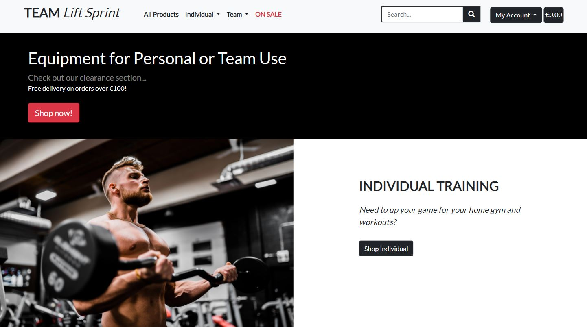
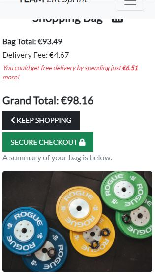

<h1>Testing Section</h1>

As per the table of contents, the following areas of testing were reviewed:

* Code validation
* Accessibility/Lighthouse testing
* Responsive testing
* Manual testing
* Testing user stories from User Experience (UX) section
* Known bugs

### Code validation
The W3C Markup Validator, W3C CSS Validator, JSHint JavaScript Validator Services and PEP8 online were used to validate the project to ensure there were no errors in the project. 

##### W3C CSS Validator

See the below screenshot for W3C CSS validation, with no errors present:

##### W3C Markup Validator

In using the W3C markup validator, a number of non-fixable errors were present through the validation process. See below explanations for error explanation.

1) Header error

The head element is deemed to be missing the child element "title". This is present on the base.html page, however this error results where base.html is extended and as such the validator has not picked it up. No further edits required.

2) Spacing error

W3C noted that there are non-space characters inside a table. This is present on any templated language "for" loops, whereby a html tag is not present on either side of these statements. No further edits required due to python language used in HTML templates.

3) URL error

This refers to the use of "{}" url references throughout the HTML pages. These braces are used for site references and again, due to django language site navigation. No edits required.

4) Sort error

The below three errors are present on the HTML pages where the sort function is used. Python language "if" statement is present on the user interactive sort statement and possible through the use of python logic. No edits necessary.

As above explanations, these are not true errors but due to the templating language present in Django/Python language. HTML validation showed no further errors and as such this project has passed this testing protocol.

##### JSHint JavaScript Validator Services

See below screenshots for results on JSHint validation on seperate JS code (3) - no errors present:

##### PEP8 online
<h1>UUUUPPPPDAAAATE</h1>

### Accessibility/Lighthouse testing

[WAVE Web Accessibility Evaluation Tool](https://wave.webaim.org/) was used on all pages to review site accessibility. No errors on the site occurred as a result of this accessibility testing.

See below for results on various pages:

* Home Page

* Products Page

* Bag Page

* Checkout Page

* Profile Page

[Google Lighthouse](https://developers.google.com/web/tools/lighthouse) was used on all pages to review site performance across a number of metrics. Green scores were awarded on the site across all lighthouse metrics as a result of this performance testing.

See below for results on various pages:

* Home Page

* Products Page

* Bag Page

* Checkout Page

* Profile Page

### Responsive testing

The site adheres to the Bootstrap grid layout and breakpoints. Additional media queries have been used to align many aspects of the site. The media breakpoints have been noted in the README.md file.
[Responsinator](https://www.responsinator.com/) has also been used to review the layout online across a broad range of physical and virtual desktop, tablet and mobile devices.
<h1>UUUPPPPDAAAATE</h1>

Virtual devices have consisted of testing on the following screen types on Google Chrome:

#### Snippets of site page screenshots across device widths

Widths used to test the below are:
* 1400px - desktop
* 768px - ipad
* 320px - iPhone 5SE

##### Home page

##### Products page

##### View product page

##### Bag page

##### Checkout page

##### Profile page

### Manual testing
<h1>UUUUUUPPPPDAAAAATE</h1>

### Testing user stories from User Experience (UX) section

The below is the testing section of both the first time and frequent visitors user story requirements. The table is split as following:
- User story requirement as per ReadMe file
- Response design as per ReadMe file
- Relevent project screenshot(s)/narrative

Number | User story requirement | Response design | Screenshot(s)/Narrative
------ | ---------------------- | --------------- | -----------------------
1 | My impression of the site to be a positive experience | Colour/Font/Layout/Navigation/CTA structure. Responsive button elements and appropriate redirects/toast/CRUD messages. Clear call to action on user progression from site landing to purchasing item(s). | Below

Number | User story requirement | Response design | Screenshot(s)/Narrative
------ | ---------------------- | --------------- | -----------------------
2 | To understand the main purpose of the site | Displayed on the landing “home” page. | Below

Number | User story requirement | Response design | Screenshot(s)/Narrative
------ | ---------------------- | --------------- | -----------------------
3 | To purchase relevant equipment related to individual/team sports | Content of the home page displays clear CTA on which section the user should click. Further, Navbar links are split appropriately based on product category | Below

Number | User story requirement | Response design | Screenshot(s)/Narrative
------ | ---------------------- | --------------- | -----------------------
4 | Create a profile - including login/register functionality | Available in the navbar for non-registered/non-logged in users. | Below

Number | User story requirement | Response design | Screenshot(s)/Narrative
------ | ---------------------- | --------------- | -----------------------
5 | An instant feedback loop from site navigation on what I am doing | The use of toast popups and checkout success features provides feedback to users on edit/delete/checkout bag items. | Below

Number | User story requirement | Response design | Screenshot(s)/Narrative
------ | ---------------------- | --------------- | -----------------------
6 | Easy navigation of the site including searching for a term | Site is simplistic in nature as an online store - 3 click approach taken as noted in the UX section of this ReadMe. Search bar included in navbar | Below

Number | User story requirement | Response design | Screenshot(s)/Narrative
------ | ---------------------- | --------------- | -----------------------
7 | Built-in safety protocols – user authentication, appropriate redirects, site action feedback | Django allauth templates are included in the project for use of their safety protocols | Below

Number | User story requirement | Response design | Screenshot(s)/Narrative
------ | ---------------------- | --------------- | -----------------------
8 | The ability to edit/delete any items in my bag | Any user can edit/delete bag items when they view their bag before checkout. | Below

Number | User story requirement | Response design | Screenshot(s)/Narrative
------ | ---------------------- | --------------- | -----------------------
9 | Secure card payment protocols | Stripe safety protocols and card processing is applied, allowing the user to securely checkout. | Below

Number | User story requirement | Response design | Screenshot(s)/Narrative
------ | ---------------------- | --------------- | -----------------------
10 | Ability to view my checkout items if I have accidentally exited the site | Cookie storage in the browser allows an individual to exit the site and reenter without the loss of any items in their bag. | Manual check that cookie item has stored on site page inspection. Manual forced site browser exit - reopen of site has stored bag dictionary.
11 | Buy an item without registering | All non-registered user CRUD functionality is present despite not having an account. | Noted in 3) above.
12 | Browse products easily including sorting them | As per (3) above. Sort function present on all product pages | Below

Number | User story requirement | Response design | Screenshot(s)/Narrative
------ | ---------------------- | --------------- | -----------------------
13 | View and purchase whats on sale | On sale section linked in the navbar. Further, all products that are on sale have a red pill image showing how much they are on sale, plus the percentage discount on the product. On checkout, the user is shown how much they are saving in euro by purchasing this on sale item. | Below

Number | User story requirement | Response design | Screenshot(s)/Narrative
------ | ---------------------- | --------------- | -----------------------
14 | Have a FAQ section where I can get in touch with the company regarding shipping/delivery, etc. | FAQ links are present at the bottom of each html page of the site. | Below

Number | User story requirement | Response design | Screenshot(s)/Narrative
------ | ---------------------- | --------------- | -----------------------
15 | See if I have any shipping costs | Delivery costs are shown in both the bag, toast notifications and checkout views, as well as an indication of how much extra they should spend to obtain free delivery. | Below

Number | User story requirement | Response design | Screenshot(s)/Narrative
------ | ---------------------- | --------------- | -----------------------
16 | Ability to reset my password and forgot my password verification | Frequent vistor (1) - password functionality present on the login section of the navbar | Below

Number | User story requirement | Response design | Screenshot(s)/Narrative
------ | ---------------------- | --------------- | -----------------------
17 | View my previous orders | Frequent vistor (2) - Ability to view past orders for registered users on their profile page on the navbar | Below

Number | User story requirement | Response design | Screenshot(s)/Narrative
------ | ---------------------- | --------------- | -----------------------
18 | Log in and out easily | Frequent vistor (3) - Present on the navbar | Noted in 4) and 7) above
19 | Save/Update my contact details | Frequent vistor (4) - Registered users can update their contact/delivery/billing details on the profile app, which feed directly into the checkout app for their next purchase | Below

### Known bugs

<h1>UUUUUUPPPPDAAAAATE</h1>
